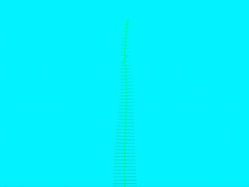

#seaWeed animation
This openFrameworks code uses polylines and their normals to create a seaweed shape, which is controlled through cos variables to simulate seaweed swaying under water. 

## Known Issues
The normal lines that make up the seaweed leaves sometimes change angles dramatically. 